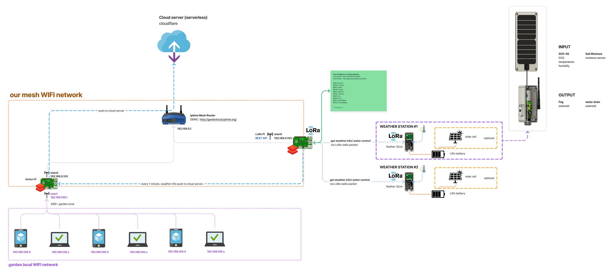
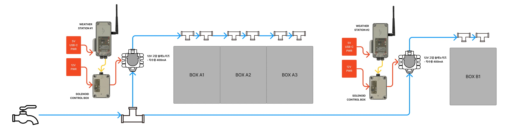

# hardware connection overview


# router setting
## WIFI information 
```
5G   : dwc2Mesh  / choitaeyoonStudio
2.4G : dwc2Mesh2 / choitaeyoonStudio
```
## DHCP setup
```
router IP : 192.168.0.1
gateway address : 192.168.0.1
DHCP IP assign range : 192.168.0.2 - 192.168.0.254
subnet mask : 255.255.255.0

----
lichen Pi : 192.168.0.102
LoRa Pi   : 192.168.0.105
```

## DDNS setup
we can remotely connect SSH with address `http://gardenlocal.iptime.org`<br/>
mind that, DDNS address valid only if router got `public IP`. (attached to modem, not router).

DDNS `http://gardenlocal.iptime.org` 주소를 사용하여 외부에서 SSH 접속이 가능합니다.<br/>
DDNS 주소는 공유기가 공인아이피를 할당받았을때만 사용가능합니다. (다른 라우터밑에 연결되어 사설아이피를 할당받으면 안됨)

- lichen Pi SSH : `ssh http://gardenlocal.iptime.org -p2200 -lpi`
- lora Pi SSH : `ssh http://gardenlocal.iptime.org -p2201 -lpi`


# remote control fog machine
[POSTMAN](https://www.postman.com/downloads/) 설치 후, [collection](./assets/gardenlocalv2_endpoints.postman_collection.json)파일을 다운로드한 뒤 import 해주시기 바랍니다.<br/>
도큐멘테이션은 [이곳](https://documenter.getpostman.com/view/2662906/2s8YeuKqgo)을 찹고하세요.

## LoRa Pi python codes
-> [LoRaPi restful flask repo](https://github.com/gardenlocal/pi-LoRaReceiver-restful-flask)
- check logs on terminal
```
$ ssh gardenlocal.iptime.org -p2201 -lpi  # connect to LoRa Pi then
$ pm2 logs 
```

# weather stations 


- charging : 5V usb C / solar panel (stations #1)
- solenoid control box power : DC 12V / 2A 

## weather station firmware 
-> [weather station firmware](https://github.com/gardenlocal/feather-weatherReportLoRa)
